# RPG Game Project - Clean Architecture Implementation

  

A sophisticated text-based role-playing game demonstrating modern software engineering principles, Domain-Driven Design (DDD), Event Sourcing, and Clean Architecture patterns.

  

## 🎯 Project Overview

  

This project implements a comprehensive RPG game system with multiple interfaces (Console, Web API, and Angular UI) built using .NET 8 and modern architectural patterns. The game features character creation, combat systems, inventory management, quest systems, and persistent game state through event sourcing.

  

### Key Features

  

- **Character System**: Three character classes (Warrior, Mage, Rogue) with unique abilities

- **Combat Mechanics**: Turn-based combat with special abilities and critical hits

- **Inventory Management**: Equipment system with different item types and slots

- **Quest System**: Completable quests with rewards and progression tracking

- **World Exploration**: Connected locations with random encounters

- **Save/Load System**: Persistent game state with autosave functionality

- **Event-Driven Architecture**: Real-time notifications and event sourcing

- **Multiple UIs**: Console application, REST API, and modern Angular frontend

  

---

  

## 🏗️ Architecture Overview

  

The project follows **Clean Architecture** principles with clear separation of concerns across multiple layers:

  

```mermaid

graph TB

    subgraph "Presentation Layer"

        A[Console UI<br/>RpgGame.Presentation]

        B[Web API<br/>RpgGame.WebApi]

        C[Angular UI<br/>RpgGame.AngularUI]

    end

    subgraph "Application Layer"

        D[Application Services<br/>RpgGame.Application]

        E[Commands & Queries<br/>CQRS Pattern]

        F[Event Handlers<br/>Domain Event Processing]

    end

    subgraph "Domain Layer"

        G[Domain Entities<br/>Character, Item, Quest]

        H[Domain Events<br/>Business Events]

        I[Domain Services<br/>Business Logic]

    end

    subgraph "Infrastructure Layer"

        J[Data Persistence<br/>Entity Framework]

        K[Event Store<br/>Event Sourcing]

        L[External Services<br/>File System, etc.]

    end

    A --> D

    B --> D

    C --> B

    D --> G

    D --> K

    E --> G

    F --> H

    J --> G

    K --> H

    L --> D

    style G fill:#e1f5fe

    style D fill:#fff3e0

    style A fill:#f3e5f5

    style J fill:#e8f5e8

```

  

### Layer Responsibilities

  

#### 🎨 Presentation Layer

  

- **Console UI**: Text-based interface for direct game interaction

- **Web API**: RESTful endpoints for external client integration

- **Angular UI**: Modern SPA with rich user experience

  

#### 🔄 Application Layer

  

- **Commands**: Write operations that modify system state

- **Queries**: Read operations that retrieve data

- **Event Handlers**: Process domain events for cross-cutting concerns

- **Services**: Orchestrate complex business workflows

  

#### 🎯 Domain Layer

  

- **Entities**: Core business objects with identity and behavior

- **Value Objects**: Immutable objects representing concepts

- **Domain Events**: Represent significant business occurrences

- **Aggregates**: Consistency boundaries for business operations

  

#### 🗄️ Infrastructure Layer

  

- **Repositories**: Data access abstraction

- **Event Store**: Persistent event storage

- **External Services**: File system, networking, etc.

  

---

  

## 📐 Domain Model

  

### Core Entities and Relationships

  

```mermaid

classDiagram

  

    IHasDomainEvents <|-- DomainEntity

  

    DomainEntity <|-- Character

  

    ICharacter <|-- Character

  

    ICharacter <|-- INonPlayerCharacter

  

    ICharacter <|-- IPlayerCharacter

  

    Character <|-- NonPlayerCharacter

  

    Character <|-- PlayerCharacter

  

    INonPlayerCharacter <|-- NonPlayerCharacter

  

    NonPlayerCharacter <|-- Enemy

  

    IPlayerCharacter <|-- PlayerCharacter

  

    PlayerCharacter <|-- Warrior

  

    PlayerCharacter <|-- Mage

  

    PlayerCharacter <|-- Rogue

  

  

    PlayerCharacter --> IInventory : Inventory

  

    PlayerCharacter --> IEquipment : equips

  

    IInventory --> IItem

  

    IItem <|-- IEquipment

  

    IItem <|-- IConsumable

  

  

    class IHasDomainEvents {

  

        <<interface>>

  

        +IReadOnlyList<IDomainEvent> DomainEvents

  

        +ClearDomainEvents()

  

    }

  

    class DomainEntity {

  

        <<abstract>>

  

        +Guid Id

  

        +int Version

  

        +IReadOnlyList<IDomainEvent> DomainEvents

  

        +ClearDomainEvents()

  

    }

  

    class ICharacter {

  

        <<interface>>

  

        +string Name

  

        +int Health

  

        +int MaxHealth

  

        +int Level

  

        +bool IsAlive

  

        +Attack(target)

  

        +TakeDamage(damage)

  

        +Heal(amount)

  

        +LevelUp()

  

    }

  

    class Character {

  

        <<abstract>>

  

        -string _name

  

        -int _health

  

        -int _maxHealth

  

        -int _level

  

        -int _strength

  

        -int _defense

  

        +CalculateDamage()

  

        +OnBeforeAttack()

  

        +OnAfterAttack()

  

        +OnDeath()

  

    }

  

    class INonPlayerCharacter{

  

        <<interface>>

  

        +bool IsFriendly

  

        +string Dialogue

  

        +Interact(player)

  

    }

  

    class NonPlayerCharacter {

  

        <<abstract>>

  

        +bool IsFriendly

  

        +string Dialogue

  

        +Interact(player)

  

    }

  

    class IPlayerCharacter {

  

        <<interface>>

  

        +int Experience

  

        +int ExperienceToNextLevel

  

        +IInventory Inventory

  

        +GainExperience(amount)

  

        +EquipItem(item)

  

        +UseItem(item)

  

        +UseSpecialAbility(target)

  

    }

  

    class PlayerCharacter {

  

        <<abstract>>

  

        -int _experience

  

        -IInventory _inventory

  

        -Dictionary<EquipmentSlot, IEquipment> _equippedItems

  

        +GainExperience(amount)

  

        +EquipItem(item)

  

        +UseItem(item)

  

        +UseSpecialAbility(target)

  

    }

  

    class Warrior {

  

        +Create(name)

  

        +UseSpecialAbility(target)

  

    }

  

    class Mage {

  

        -int _mana

  

        -int _maxMana

  

        +int Mana

  

        +int MaxMana

  

        +SpendMana(amount)

  

        +RestoreMana(amount)

  

        +Create(name)

  

        +UseSpecialAbility(target)

  

    }

  

    class Rogue {

  

        -double _criticalChance

  

        +double CriticalChance

  

        +Create(name)

  

        +UseSpecialAbility(target)

  

        +Attack(target)

  

    }

  

    class Enemy {

  

        <<abstract>>

  

        +int ExperienceReward

  

        +IReadOnlyList<IItem> LootTable

  

        +DropLoot()

  

        +Interact(player)

  

        +OnDeath()

  

    }

  

    class IInventory {

  

        <<interface>>

  

        +IReadOnlyList<IItem> Items

  

        +int Capacity

  

        +int Gold

  

        +AddItem(item)

  

        +RemoveItem(item)

  

        +AddGold(amount)

  

        +SpendGold(amount)

  

    }

  

    class IItem {

  

        <<interface>>

  

        +string Name

  

        +string Description

  

        +int Value

  

        +ItemType Type

  

    }

  

    class IEquipment {

  

        <<interface>>

  

        +EquipmentSlot Slot

  

        +int BonusValue

  

        +OnEquip(character)

  

        +OnUnequip(character)

  

    }

  

    class IConsumable {

  

        <<interface>>

  

        +OnUse(character)

  

    }

```

  

### Character Specializations

  

#### Warrior

  

- **High Health & Defense**: Tank role with superior survivability

- **Powerful Attacks**: Special ability deals double damage

- **Equipment Focus**: Can carry more items and equipment

- **Starting Stats**: 150 HP, 20 Strength, 10 Defense

  

#### Mage

  

- **Mana System**: Uses mana for powerful spells

- **Magical Abilities**: Special ability costs mana but deals triple damage

- **Lower Health**: Balanced by powerful ranged attacks

- **Starting Stats**: 100 HP, 10 Strength, 5 Defense, 150 Mana

  

#### Rogue

  

- **Critical Hits**: Chance for double damage on attacks

- **Agility Focus**: Balanced stats with critical strike mechanics

- **Stealth Abilities**: Backstab special ability for triple damage

- **Starting Stats**: 120 HP, 15 Strength, 8 Defense, 15% Crit Chance

  

---

  

## 🔄 Event-Driven Architecture

  

The system uses Domain Events to maintain loose coupling and enable complex business workflows:

  

```mermaid

sequenceDiagram

    participant Client

    participant API as Web API

    participant MediatR

    participant Handler as Command Handler

    participant Domain as Domain Entity

    participant EventStore as Event Store

    participant EventHandler as Event Handler

    participant SignalR as SignalR Hub

    Client->>API: POST /characters/{id}/levelup

    API->>MediatR: Send LevelUpCharacterCommand

    MediatR->>Handler: Handle Command

    Handler->>Domain: character.LevelUp()

    Domain->>Domain: Raise CharacterLeveledUp Event

    Handler->>EventStore: Save Events

    EventStore->>EventHandler: Dispatch Events

    EventHandler->>SignalR: Broadcast Notification

    SignalR->>Client: Real-time Update

    Handler->>API: Return Success

    API->>Client: HTTP 200 OK

```

  

### Domain Events

  

```mermaid

graph LR

    subgraph "Character Events"

        A[CharacterCreatedEvent]

        B[CharacterLeveledUp]

        C[CharacterDied]

        D[PlayerGainedExperience]

        E[PlayerLocationChanged]

    end

    subgraph "Combat Events"

        F[CombatVictoryEvent]

        G[CombatDefeatEvent]

    end

    subgraph "Game Events"

        H[GameSavedEvent]

        I[GameLoadedEvent]

    end

    subgraph "Event Handlers"

        J[CharacterLeveledUpHandler]

        K[CombatVictoryHandler]

        L[NotificationService]

        M[CharacterStateChangedHandler]

    end

    A --> J

    B --> J

    B --> L

    C --> L

    F --> K

    F --> M

    H --> M

```

  

---

  

## 🏛️ CQRS Implementation

  

Commands and Queries are separated to optimize for different concerns:

  

### Command Flow

  

```mermaid

graph LR

    A[Client Request] --> B[API Controller]

    B --> C[MediatR]

    C --> D[Validation Behavior]

    D --> E[Command Handler]

    E --> F[Domain Entity]

    F --> G[Event Store]

    G --> H[Event Dispatcher]

    H --> I[Event Handlers]

    style E fill:#ffcdd2

    style F fill:#e1f5fe

    style I fill:#f3e5f5

```

  

### Query Flow

  

```mermaid

graph LR

    A[Client Request] --> B[API Controller]

    B --> C[MediatR]

    C --> D[Query Handler]

    D --> E[Event Store/Repository]

    E --> F[Domain Reconstruction]

    F --> G[DTO Mapping]

    G --> H[Response]

    style D fill:#e8f5e8

    style E fill:#fff3e0

    style G fill:#f3e5f5

```

  

### Commands

  

- **CreateCharacterCommand**: Creates new player characters

- **LevelUpCharacterCommand**: Advances character level

- **EquipItemCommand**: Equips items to characters

- **UseItemCommand**: Consumes items from inventory

  

### Queries

  

- **GetCharacterByIdQuery**: Retrieves character details

- **GetAllCharactersQuery**: Lists all characters

- **GetCharacterInventoryQuery**: Retrieves character inventory

- **GetCharacterHistoryQuery**: Gets character event history

  

---

  

## 💾 Event Sourcing

  

Characters are persisted as streams of events rather than current state:

  

```mermaid

graph TB

    subgraph "Event Stream"

        A[CharacterCreatedEvent<br/>Name: 'Aragorn'<br/>Type: Warrior]

        B[CharacterLeveledUp<br/>Old: 1, New: 2<br/>Stats: +10 HP, +2 STR]

        C[PlayerGainedExperience<br/>Amount: 150<br/>Total: 350]

        D[CharacterLeveledUp<br/>Old: 2, New: 3<br/>Stats: +10 HP, +2 STR]

    end

    subgraph "Current State Reconstruction"

        E[Load Events] --> F[Apply Events in Order]

        F --> G[Warrior 'Aragorn'<br/>Level 3<br/>HP: 130/130<br/>STR: 24]

    end

    A --> E

    B --> F

    C --> F

    D --> F

    style A fill:#e3f2fd

    style B fill:#e8f5e8

    style C fill:#fff3e0

    style D fill:#e8f5e8

    style G fill:#ffcdd2

```

  

### Event Store Schema

  

```sql

CREATE TABLE StoredEvents (

    Id UNIQUEIDENTIFIER PRIMARY KEY,

    AggregateId UNIQUEIDENTIFIER NOT NULL,

    AggregateType NVARCHAR(255) NOT NULL,

    Version INT NOT NULL,

    EventType NVARCHAR(255) NOT NULL,

    EventData NVARCHAR(MAX) NOT NULL,

    Timestamp DATETIME2 NOT NULL,

    UserId NVARCHAR(255) NULL

);

```

  

### Benefits

  

- **Complete Audit Trail**: Every change is recorded

- **Temporal Queries**: Query state at any point in time

- **Bug Investigation**: Replay events to understand issues

- **Analytics**: Rich data for understanding player behavior

  

---

  

## 🎮 Game Systems

  

### Combat System

```mermaid

stateDiagram-v2

    [*] --> SelectTarget

    SelectTarget --> CalculateDamage

    CalculateDamage --> ApplyDamage

    ApplyDamage --> CheckCritical: Rogue

    CheckCritical --> ApplyDamage

    ApplyDamage --> CheckDeath

    CheckDeath --> Victory: Enemy Defeated

    CheckDeath --> Continue: Both Alive

    Continue --> EnemyTurn

    EnemyTurn --> SelectTarget

    Victory --> DropLoot

    DropLoot --> GainExperience

    GainExperience --> [*]

```

  



  

### Inventory System

  

```mermaid

graph LR

    subgraph "Inventory Management"

        A[Add Item] --> B{Space Available?}

        B -->|Yes| C[Add to Collection]

        B -->|No| D[Inventory Full]

        C --> E[Update UI]

    end

    subgraph "Equipment System"

        F[Equip Item] --> G{Is Equipment?}

        G -->|Yes| H{Slot Available?}

        G -->|No| I[Cannot Equip]

        H -->|Yes| J[Equip Item]

        H -->|No| K[Unequip Current]

        K --> J

        J --> L[Apply Bonuses]

        L --> M[Update Stats]

    end

    C --> F

```

  

### Quest System (Planned)

  

```mermaid

graph TB

    A[Quest Giver] --> B[Accept Quest]

    B --> C[Track Objectives]

    C --> D{All Complete?}

    D -->|No| E[Continue Progress]

    E --> C

    D -->|Yes| F[Return to Giver]

    F --> G[Receive Rewards]

    G --> H[Experience]

    G --> I[Gold]

    G --> J[Items]

```

  

---

  

## 🔧 Technical Implementation

  

### Dependency Injection Setup

  

```csharp

// Program.cs - Web API

builder.Services.AddApplicationServices();

builder.Services.AddInfrastructureServices(builder.Configuration);

  

// Application Layer Registration

public static IServiceCollection AddApplicationServices(this IServiceCollection services)

{

    services.AddMediatR(cfg => cfg.RegisterServicesFromAssembly(Assembly.GetExecutingAssembly()));

    services.AddValidatorsFromAssembly(Assembly.GetExecutingAssembly());

    // Pipeline behaviors

    services.AddTransient(typeof(IPipelineBehavior<,>), typeof(ValidationBehavior<,>));

    services.AddTransient(typeof(IPipelineBehavior<,>), typeof(LoggingBehavior<,>));

    // Event infrastructure

    services.AddScoped<IEventDispatcher, EventDispatcher>();

    services.AddScoped<IEventSourcingService, EventSourcingService>();

    return services;

}

```

  

### Pipeline Behaviors

  

```mermaid

graph LR

    A[Request] --> B[Validation Behavior]

    B --> C[Logging Behavior]

    C --> D[Performance Behavior]

    D --> E[Command/Query Handler]

    E --> F[Event Sourcing Behavior]

    F --> G[Response]

    style B fill:#ffcdd2

    style C fill:#e8f5e8

    style D fill:#fff3e0

    style E fill:#e1f5fe

    style F fill:#f3e5f5

```

  

### API Versioning

  

```csharp

[ApiController]

[ApiVersion("1.0")]

[Route("api/v{version:apiVersion}/[controller]")]

public class CharactersController : ControllerBase

{

    // API endpoints

}

```

  

### Real-time Notifications

  

```csharp

// SignalR Hub for real-time updates

public class GameHub : Hub

{

    public async Task JoinCharacterGroup(Guid characterId)

    {

        await Groups.AddToGroupAsync(Context.ConnectionId, characterId.ToString());

    }

}

  

// Event handler that broadcasts notifications

public class NotificationService : IEventHandler<CharacterLeveledUp>

{

    public async Task HandleAsync(CharacterLeveledUp @event, CancellationToken cancellationToken)

    {

        await _hubContext.Clients.Group(@event.AggregateId.ToString())

            .SendAsync("GameEvent", new { Type = "level-up", Data = @event });

    }

}

```

  

---

  

## 🚀 Getting Started

  

### Prerequisites

  

- .NET 8 SDK

- Node.js 18+ (for Angular UI)

- SQLite (for local development)

- Visual Studio 2022 or VS Code

  

### Installation

  

1. **Clone the Repository**

    ```bash

    git clone https://github.com/yourusername/rpg-game.git

    cd rpg-game

    ```

2. **Build the Solution**

    ```bash

    dotnet build

    ```

3. **Run Console Application**

    ```bash

    cd src/RpgGame.Presentation

    dotnet run

    ```

4. **Run Web API**

    ```bash

    cd src/RpgGame.WebApi

    dotnet run

    ```

    API will be available at `https://localhost:7153`

5. **Run Angular UI**

    ```bash

    cd src/RpgGame.AngularUI/rpg-game-ui

    npm install

    ng serve

    ```

    UI will be available at `http://localhost:4200`

  

### Database Setup

  

The application uses SQLite with Entity Framework Core. The database is created automatically on first run.

  

---

  

## 📊 Project Structure

  

```

src/

├── RpgGame.Domain/                 # Core business logic

│   ├── Entities/                   # Domain entities

│   │   ├── Characters/            # Character hierarchies

│   │   ├── Items/                 # Item system

│   │   ├── Inventory/             # Inventory management

│   │   └── World/                 # Game world

│   ├── Interfaces/                # Domain interfaces

│   ├── Events/                    # Domain events

│   ├── Enums/                     # Domain enumerations

│   └── Base/                      # Base classes

│

├── RpgGame.Application/           # Application orchestration

│   ├── Commands/                  # Write operations

│   ├── Queries/                   # Read operations

│   ├── Events/                    # Event handling

│   ├── Services/                  # Application services

│   ├── Behaviors/                 # Pipeline behaviors

│   └── Interfaces/                # Application interfaces

│

├── RpgGame.Infrastructure/        # External concerns

│   ├── Persistence/              # Data access

│   │   ├── EFCore/               # Entity Framework

│   │   ├── Repositories/         # Repository implementations

│   │   └── EventStore/           # Event storage

│   └── Services/                 # External services

│

├── RpgGame.Presentation/         # Console UI

│   ├── Views/                    # Console views

│   ├── Commands/                 # Console commands

│   └── ConsoleUI/                # Console infrastructure

│

├── RpgGame.WebApi/               # REST API

│   ├── Controllers/              # API controllers

│   ├── DTOs/                     # Data transfer objects

│   ├── Filters/                  # API filters

│   ├── Hubs/                     # SignalR hubs

│   └── Services/                 # API services

│

└── RpgGame.AngularUI/            # Angular frontend

    └── rpg-game-ui/

        ├── src/app/

        │   ├── components/       # Angular components

        │   ├── services/         # Angular services

        │   └── models/           # TypeScript models

        └── ...

```

  

---

  

## 🧪 Testing Strategy

  

### Unit Tests

  

```csharp

[TestClass]

public class CharacterTests

{

    [TestMethod]

    public void Character_LevelUp_ShouldIncreaseStats()

    {

        // Arrange

        var warrior = Warrior.Create("TestWarrior");

        var initialLevel = warrior.Level;

        var initialHealth = warrior.MaxHealth;

  

        // Act

        warrior.LevelUp();

  

        // Assert

        Assert.AreEqual(initialLevel + 1, warrior.Level);

        Assert.AreEqual(initialHealth + 10, warrior.MaxHealth);

    }

}

```

  

### Integration Tests

  

```csharp

[TestClass]

public class CharacterControllerTests : IntegrationTestBase

{

    [TestMethod]

    public async Task CreateCharacter_ShouldReturnCreatedCharacter()

    {

        // Arrange

        var request = new CreateCharacterDto

        {

            Name = "TestHero",

            Type = CharacterType.Warrior

        };

  

        // Act

        var response = await Client.PostAsJsonAsync("/api/v1/characters", request);

  

        // Assert

        response.EnsureSuccessStatusCode();

        var character = await response.Content.ReadFromJsonAsync<CharacterDto>();

        Assert.AreEqual("TestHero", character.Name);

    }

}

```

  

---

  

## 📈 Future Enhancements

  

### Planned Features

  

- **Multiplayer Support**: Real-time multiplayer battles

- **Advanced Quest System**: Branching storylines and complex objectives

- **Crafting System**: Item creation and enhancement

- **Guild System**: Player organizations and group activities

- **PvP Arena**: Player vs Player combat

- **Achievement System**: Unlockable rewards and progression tracking

  

### Technical Improvements

  

- **Microservices**: Split into bounded contexts

- **CQRS Read Models**: Optimized query projections

- **Distributed Event Store**: Scale event storage

- **Caching Layer**: Redis for performance optimization

- **GraphQL API**: Flexible query capabilities

- **Mobile Apps**: Native iOS/Android clients

  

---

  

## 🤝 Contributing

  

We welcome contributions! Please follow these guidelines:

  

1. **Fork the Repository**

2. **Create a Feature Branch**

    ```bash

    git checkout -b feature/amazing-feature

    ```

3. **Commit Changes**

    ```bash

    git commit -m 'Add amazing feature'

    ```

4. **Push to Branch**

    ```bash

    git push origin feature/amazing-feature

    ```

5. **Open a Pull Request**

  

### Development Guidelines

  

- Follow SOLID principles

- Write comprehensive tests

- Use meaningful commit messages

- Document public APIs

- Maintain backwards compatibility

  

---

  

## 📝 License

  

This project is licensed under the MIT License - see the [LICENSE](https://claude.ai/chat/LICENSE) file for details.

  

---

  

## 🏆 Acknowledgments

  

- **Eric Evans** - Domain-Driven Design concepts

- **Robert C. Martin** - Clean Architecture principles

- **Martin Fowler** - Enterprise patterns and event sourcing

- **Microsoft** - .NET ecosystem and documentation

- **Angular Team** - Frontend framework

- **MediatR Contributors** - CQRS implementation