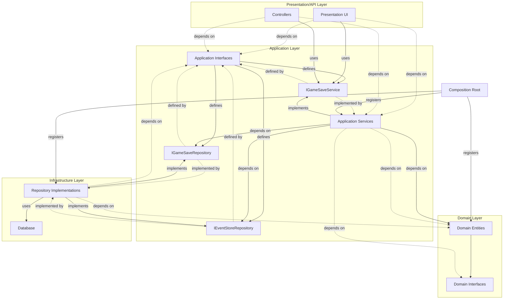
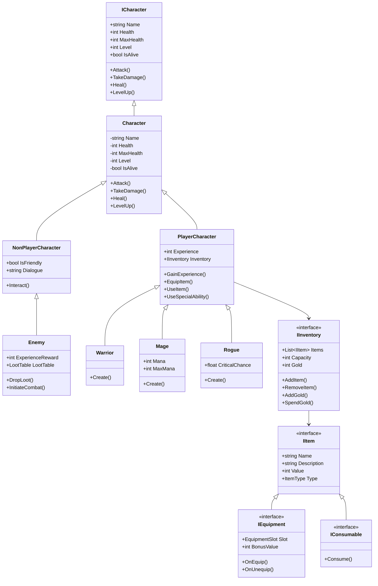

# RPG Game Domain  

This project defines the core domain logic for an RPG game, including characters, items, quests, and game mechanics. It is built using C# 12.0 and targets .NET 8. The architecture is modular and extensible, leveraging interfaces, abstract classes, and enums to represent various game elements.  

---  

## **Project Structure**  

The project is organized into the following key components:  

### **1. Interfaces**  
Interfaces define the contracts for various entities in the game, ensuring consistent behavior across implementations.  

#### **Characters**  
- **`ICharacter`**: Base interface for all characters.  
 - Properties: `Name`, `Health`, `MaxHealth`, `Level`, `IsAlive`.  
 - Methods: `Attack`, `TakeDamage`, `Heal`, `LevelUp`.  

- **`INonPlayerCharacter`**: Extends `ICharacter` for NPC-specific behavior.  
 - Properties: `IsFriendly`, `Dialogue`.  
 - Methods: `Interact`.  

- **`IPlayerCharacter`**: Extends `ICharacter` for player-specific behavior.  
 - Properties: `Experience`, `ExperienceToNextLevel`, `Inventory`.  
 - Methods: `GainExperience`, `EquipItem`, `UseItem`, `UseSpecialAbility`.  

#### **Items**  
- **`IItem`**: Base interface for all items.  
 - Properties: `Name`, `Description`, `Value`, `Type`.  

- **`IEquipment`**: Extends `IItem` for equippable items.  
 - Properties: `Slot`, `BonusValue`.  
 - Methods: `OnEquip`, `OnUnequip`.  

- **`IConsumable`**: Extends `IItem` for consumable items.  
 - Methods: `Consume`.  

#### **Inventory**  
- **`IInventory`**: Manages a character's inventory.  
 - Properties: `Items`, `Capacity`, `Gold`.  
 - Methods: `AddItem`, `RemoveItem`, `AddGold`, `SpendGold`.  

#### **Quests**  
- **`IQuest`**: Represents a quest in the game.  
 - Properties: `Name`, `Description`, `IsCompleted`.  
 - Methods: `Complete`.  

---  

### **2. Enums**  
Enums categorize various game elements for better readability and maintainability.  

- **`CharacterType`**: Defines types of characters (e.g., Warrior, Mage).  
- **`DamageType`**: Defines types of damage (e.g., Physical, Magical).  
- **`EnemyType`**: Defines types of enemies (e.g., Goblin, Dragon).  
- **`EquipmentSlot`**: Defines equipment slots (e.g., Head, Chest).  
- **`ItemType`**: Defines types of items (e.g., Weapon, Potion).  
- **`LocationType`**: Defines types of locations (e.g., Town, Dungeon).  

---  

### **3. Entities**  
Entities provide concrete implementations of the interfaces and define the behavior of game elements.  

#### **Characters**  
- **`Character`**: Abstract base class implementing `ICharacter`.  
 - Handles common character logic like attacking, taking damage, healing, and leveling up.  
 - Includes protected methods for customization (e.g., `OnBeforeAttack`, `OnDeath`).  

- **`NonPlayerCharacter`**: Abstract class extending `Character` for NPCs.  
 - Adds properties like `IsFriendly` and `Dialogue`.  
 - Defines interaction behavior with players.  

- **`PlayerCharacter`**: Concrete class for player-controlled characters.  
 - Implements inventory and experience management.  

- **`Enemy`**: Abstract class extending `NonPlayerCharacter` for enemies.  
 - Adds properties like `ExperienceReward` and `LootTable`.  
 - Includes methods for dropping loot and initiating combat.  

#### **Items**  
- **`Item`**: Base class implementing `IItem`.  
 - Provides shared logic for all items, such as name, description, and value.  

- **`Equipment`**: Implements `IEquipment`.  
 - Adds logic for equipping and unequipping items, with bonuses applied to characters.  

- **`Consumable`**: Implements `IConsumable`.  
 - Adds logic for consuming items, such as healing potions or buffs.  

#### **Inventory**  
- **`Inventory`**: Implements `IInventory`.  
 - Manages a collection of items, enforces capacity limits, and tracks gold.  

#### **Quests**  
- **`Quest`**: Implements `IQuest`.  
 - Tracks quest progress and completion status.  

---  

## **Design Patterns**  

### **1. Factory Pattern**  
The factory pattern is used to create instances of characters, items, and quests. This ensures that the creation logic is centralized and consistent.  

Example:  
- A `CharacterFactory` creates instances of `PlayerCharacter` or `Enemy` based on the input parameters.  
- An `ItemFactory` creates instances of `Equipment` or `Consumable` based on the item type.  

# RPG Game Domain  

This project defines the core domain logic for an RPG game, including characters, items, quests, and game mechanics. It is built using C# 12.0 and targets .NET 8. The architecture is modular and extensible, leveraging interfaces, abstract classes, and enums to represent various game elements.  

---  

## **How the Application Works**  

The RPG Game Domain is designed to simulate the core mechanics of an RPG game. It includes:  
- **Characters**: Player-controlled characters (e.g., Warrior, Mage, Rogue) and non-player characters (e.g., Skeleton enemies).  
- **Items**: Equipment (e.g., weapons, armor) and consumables (e.g., potions).  
- **Quests**: Tasks that players can complete for rewards.  
- **Combat System**: Characters can attack, take damage, heal, and level up.  
- **Inventory Management**: Players can manage items and gold.  

The application uses a modular design to ensure that new features, such as additional character types or items, can be added with minimal changes to the existing codebase.  

---  

## **Project Structure**  

The project is organized into the following key components:  

### **1. Interfaces**  
Interfaces define the contracts for various entities in the game, ensuring consistent behavior across implementations.  

#### **Characters**  
- **`ICharacter`**: Base interface for all characters.  
 - Properties: `Name`, `Health`, `MaxHealth`, `Level`, `IsAlive`.  
 - Methods: `Attack`, `TakeDamage`, `Heal`, `LevelUp`.  

- **`INonPlayerCharacter`**: Extends `ICharacter` for NPC-specific behavior.  
 - Properties: `IsFriendly`, `Dialogue`.  
 - Methods: `Interact`.  

- **`IPlayerCharacter`**: Extends `ICharacter` for player-specific behavior.  
 - Properties: `Experience`, `ExperienceToNextLevel`, `Inventory`.  
 - Methods: `GainExperience`, `EquipItem`, `UseItem`, `UseSpecialAbility`.  

#### **Items**  
- **`IItem`**: Base interface for all items.  
 - Properties: `Name`, `Description`, `Value`, `Type`.  

- **`IEquipment`**: Extends `IItem` for equippable items.  
 - Properties: `Slot`, `BonusValue`.  
 - Methods: `OnEquip`, `OnUnequip`.  

- **`IConsumable`**: Extends `IItem` for consumable items.  
 - Methods: `Consume`.  

#### **Inventory**  
- **`IInventory`**: Manages a character's inventory.  
 - Properties: `Items`, `Capacity`, `Gold`.  
 - Methods: `AddItem`, `RemoveItem`, `AddGold`, `SpendGold`.  

#### **Quests**  
- **`IQuest`**: Represents a quest in the game.  
 - Properties: `Name`, `Description`, `IsCompleted`.  
 - Methods: `Complete`.  

---  

### **2. Enums**  
Enums categorize various game elements for better readability and maintainability.  

- **`CharacterType`**: Defines types of characters (e.g., Warrior, Mage).  
- **`DamageType`**: Defines types of damage (e.g., Physical, Magical).  
- **`EnemyType`**: Defines types of enemies (e.g., Goblin, Dragon).  
- **`EquipmentSlot`**: Defines equipment slots (e.g., Head, Chest).  
- **`ItemType`**: Defines types of items (e.g., Weapon, Potion).  
- **`LocationType`**: Defines types of locations (e.g., Town, Dungeon).  

---  

### **3. Entities**  
Entities provide concrete implementations of the interfaces and define the behavior of game elements.  

#### **Characters**  
- **`Character`**: Abstract base class implementing `ICharacter`.  
 - Handles common character logic like attacking, taking damage, healing, and leveling up.  
 - Includes protected methods for customization (e.g., `OnBeforeAttack`, `OnDeath`).  

- **`PlayerCharacter`**: Concrete class for player-controlled characters.  
 - Implements inventory and experience management.  
 - Subclasses:  
   - **`Warrior`**: A melee-focused character with high defense.  
   - **`Mage`**: A magic-focused character with mana management.  
   - **`Rogue`**: A stealth-focused character with critical hit mechanics.  

- **`NonPlayerCharacter`**: Abstract class extending `Character` for NPCs.  
 - Adds properties like `IsFriendly` and `Dialogue`.  
 - Defines interaction behavior with players.  

- **`Enemy`**: Abstract class extending `NonPlayerCharacter` for enemies.  
 - Adds properties like `ExperienceReward` and `LootTable`.  
 - Includes methods for dropping loot and initiating combat.  
 - Subclasses:  
   - **`Skeleton`**: A basic enemy type.  

#### **Items**  
- **`Item`**: Base class implementing `IItem`.  
 - Provides shared logic for all items, such as name, description, and value.  

- **`Equipment`**: Implements `IEquipment`.  
 - Adds logic for equipping and unequipping items, with bonuses applied to characters.  

- **`Consumable`**: Implements `IConsumable`.  
 - Adds logic for consuming items, such as healing potions or buffs.  

#### **Inventory**  
- **`Inventory`**: Implements `IInventory`.  
 - Manages a collection of items, enforces capacity limits, and tracks gold.  

#### **Quests**  
- **`Quest`**: Implements `IQuest`.  
 - Tracks quest progress and completion status.  

---  

## **Design Patterns**  

### **1. Factory Pattern**  
The factory pattern is used to create instances of characters, items, and quests. This ensures that the creation logic is centralized and consistent.  

Example:  
- A `CharacterFactory` creates instances of `PlayerCharacter` or `Enemy` based on the input parameters.  
- An `ItemFactory` creates instances of `Equipment` or `Consumable` based on the item type.  

### **2. Inheritance and Polymorphism**  
The project heavily relies on inheritance and polymorphism to enable extensibility and code reuse.  
- The `Character` class serves as a base for all character types, with shared logic for health, leveling, and combat.  
- The `NonPlayerCharacter` and `PlayerCharacter` classes extend `Character` to add specific behavior.  

### **3. Dependency Injection**  
Dependency injection is used to decouple components and improve testability. For example, the `Inventory` class can be injected into a `PlayerCharacter` to manage their items.  

### **4. Observer Pattern**  
The observer pattern is used for event-driven mechanics, such as notifying the game engine when a quest is completed or when a character levels up.  

---  

## **UML Diagrams**  

### **1. Character Inheritance Diagram**

### **3. Dependency Injection**  
Dependency injection is used to decouple components and improve testability. For example, the `Inventory` class can be injected into a `PlayerCharacter` to manage their items.  

### **4. Observer Pattern**  
The observer pattern is used for event-driven mechanics, such as notifying the game engine when a quest is completed or when a character levels up.  

---  

## **UML Diagrams**  

### **1. Character Inheritance Diagram**
---  

---  

## **Key Features**  
- **Modular Design**: Interfaces and abstract classes allow for easy extension and customization.  
- **Encapsulation**: Fields are protected, with controlled access through properties.  
- **Polymorphism**: Enables treating different character types uniformly via the `ICharacter` interface.  
- **Extensibility**: New character types, items, or quests can be added with minimal changes to existing code.  

---  

## **Getting Started**  
1. Clone the repository.  
2. Open the solution in Visual Studio 2022.  
3. Build the project to ensure all dependencies are resolved.  
4. Explore the `Entities`, `Interfaces`, and `Enums` folders to understand the domain logic.  

---  

## **Future Enhancements**  
- Add more character types (e.g., BossEnemy, Merchant).  
- Implement advanced combat mechanics (e.g., special abilities, status effects).  
- Expand the quest system with branching storylines.  
- Introduce multiplayer support.  

---  

## **Contributing**  
Contributions are welcome! Please follow these steps:  
1. Fork the repository.  
2. Create a feature branch.  
3. Commit your changes with clear messages.  
4. Submit a pull request for review.  

---  

## **License**  
This project is licensed under the MIT License. See the `LICENSE` file for details.

## **Getting Started**  
1. Clone the repository.  
2. Open the solution in Visual Studio 2022.  
3. Build the project to ensure all dependencies are resolved.  
4. Explore the `Entities`, `Interfaces`, and `Enums` folders to understand the domain logic.  

---  

## **Future Enhancements**  
- Add more character types (e.g., BossEnemy, Merchant).  
- Implement advanced combat mechanics (e.g., special abilities, status effects).  
- Expand the quest system with branching storylines.  
- Introduce multiplayer support.  

---  

## **Contributing**  
Contributions are welcome! Please follow these steps:  
1. Fork the repository.  
2. Create a feature branch.  
3. Commit your changes with clear messages.  
4. Submit a pull request for review.  





---  

## **License**  
This project is licensed under the MIT License. See the `LICENSE` file for details.

### **2. Item Dependency Diagram**



```mermaid
graph TD
    subgraph "Domain Layer"
        D[Domain Entities]
        DI[Domain Interfaces]
    end

    subgraph "Application Layer"
        I[Application Interfaces]
        S[Application Services]
        I --defines--> IGameSaveService
        I --defines--> IGameSaveRepository
        I --defines--> IEventStoreRepository
        S --implements--> IGameSaveService
        S --depends on--> IGameSaveRepository
        S --depends on--> IEventStoreRepository
        S --depends on--> D
    end

    subgraph "Infrastructure Layer"
        DB[Database]
        RI[Repository Implementations]
        RI --implements--> IGameSaveRepository
        RI --implements--> IEventStoreRepository
        RI --uses--> DB
    end
    
    subgraph "Presentation/API Layer"
        P[Presentation UI]
        C[Controllers]
        P --uses--> IGameSaveService
        C --uses--> IGameSaveService
    end

    %% Dependencies point inward
    D ----> DI
    P -.depends on.-> S
    P -.depends on.-> I
    C -.depends on.-> S
    C -.depends on.-> I
    S -.depends on.-> D
    S -.depends on.-> DI
    RI -.depends on.-> I
    RI -.depends on.-> D
    
    %% Critical: Dependency Inversion
    IGameSaveRepository -.defined by.-> Application Layer
    IGameSaveRepository -.implemented by.-> RI
    IEventStoreRepository -.defined by.-> Application Layer
    IEventStoreRepository -.implemented by.-> RI
    IGameSaveService -.defined by.-> Application Layer
    IGameSaveService -.implemented by.-> S
    
    %% Composition Root
    CR[Composition Root]
    CR --registers--> RI
    CR --registers--> S
    CR --registers--> D
```


