# RPG Game Project - Clean Architecture Implementation

A sophisticated text-based role-playing game demonstrating modern software engineering principles, Domain-Driven Design (DDD), Event Sourcing, and Clean Architecture patterns.

## 🎯 Project Overview

This project implements a comprehensive RPG game system with multiple interfaces (Console, Web API, and Angular UI) built using .NET 8 and modern architectural patterns. The game features character creation, combat systems, inventory management, quest systems, and persistent game state through event sourcing.

### Key Features

- **Character System**: Three character classes (Warrior, Mage, Rogue) with unique abilities
- **Combat Mechanics**: Turn-based combat with special abilities and critical hits
- **Inventory Management**: Equipment system with different item types and slots
- **Quest System**: Completable quests with rewards and progression tracking
- **World Exploration**: Connected locations with random encounters
- **Save/Load System**: Persistent game state with autosave functionality
- **Event-Driven Architecture**: Real-time notifications and event sourcing
- **Multiple UIs**: Console application, REST API, and modern Angular frontend

---

## 🏗️ Architecture Overview

The project follows **Clean Architecture** principles with clear separation of concerns across multiple layers:

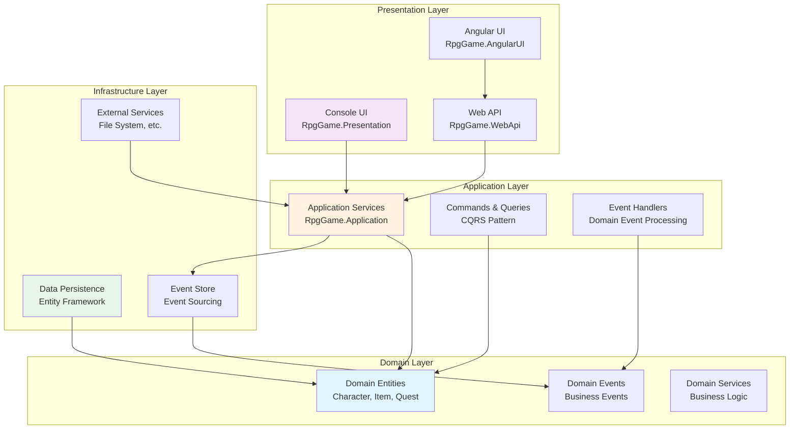

### Layer Responsibilities

#### 🎨 Presentation Layer

- **Console UI**: Text-based interface for direct game interaction
- **Web API**: RESTful endpoints for external client integration
- **Angular UI**: Modern SPA with rich user experience

#### 🔄 Application Layer

- **Commands**: Write operations that modify system state
- **Queries**: Read operations that retrieve data
- **Event Handlers**: Process domain events for cross-cutting concerns
- **Services**: Orchestrate complex business workflows

#### 🎯 Domain Layer

- **Entities**: Core business objects with identity and behavior
- **Value Objects**: Immutable objects representing concepts
- **Domain Events**: Represent significant business occurrences
- **Aggregates**: Consistency boundaries for business operations

#### 🗄️ Infrastructure Layer

- **Repositories**: Data access abstraction
- **Event Store**: Persistent event storage
- **External Services**: File system, networking, etc.

---

## 📐 Domain Model

### Core Entities and Relationships

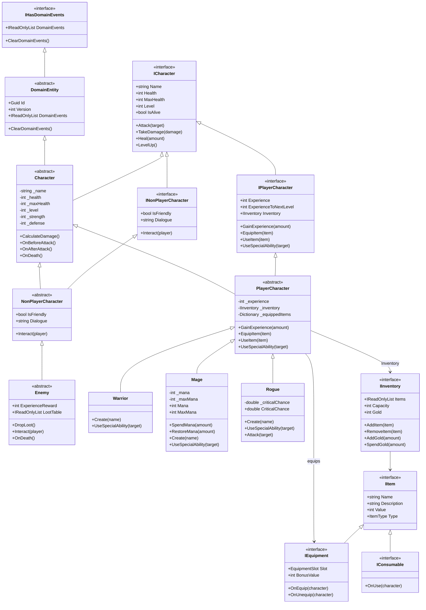

### Character Specializations

#### Warrior

- **High Health & Defense**: Tank role with superior survivability
- **Powerful Attacks**: Special ability deals double damage
- **Equipment Focus**: Can carry more items and equipment
- **Starting Stats**: 150 HP, 20 Strength, 10 Defense

#### Mage

- **Mana System**: Uses mana for powerful spells
- **Magical Abilities**: Special ability costs mana but deals triple damage
- **Lower Health**: Balanced by powerful ranged attacks
- **Starting Stats**: 100 HP, 10 Strength, 5 Defense, 150 Mana

#### Rogue

- **Critical Hits**: Chance for double damage on attacks
- **Agility Focus**: Balanced stats with critical strike mechanics
- **Stealth Abilities**: Backstab special ability for triple damage
- **Starting Stats**: 120 HP, 15 Strength, 8 Defense, 15% Crit Chance

### Core Architectural Principle: Abstract Behavior + Data-Driven Configuration

#### What Goes in C# Abstract Classes (The "How")

Abstract classes define behavioral contracts and domain rules:
```
Character (abstract)
├── PlayerCharacter (abstract) - experience, inventory, equipment mechanics
│   ├── WarriorType (enum) - different stat growth, special abilities
│   ├── MageType (enum)
│   └── RogueType (enum)
├── NonPlayerCharacter (abstract)
│   ├── Enemy (abstract) - combat, loot dropping, AI behavior
│   ├── QuestGiver (abstract) - quest management, dialogue systems
│   ├── Merchant (abstract) - trading, inventory management
│   └── Guard (abstract) - patrol behavior, law enforcement
```

#### What Goes in Database (The "What")

Database stores specific instances and configuration data:
```
EnemyTemplates Table:
- "Fierce Goblin Warrior" (EnemyType: Humanoid)
- "Ancient Red Dragon" (EnemyType: Dragon)
- "Skeleton Archer" (EnemyType: Undead)

QuestGiverTemplates Table:
- "Village Elder Marcus" (Location: Starting Village)
- "Mysterious Hooded Figure" (Location: Dark Forest)
```

####  Perfect Examples of This Pattern:

1. **Characters - Behavior vs Instance**
    **C# Abstract Classes:**

    **Character** → base health/combat system
    **Enemy** → loot dropping, aggro mechanics
    **QuestGiver** → quest offering, dialogue trees
    **Merchant** → buying/selling, inventory refresh

   ** Database Instances:**

    Specific enemies: "Goblin Scout", "Dragon Lord Pyraxis"
    Specific quest givers: "Blacksmith Jonas", "Wizard Merlin"

2. **Items - Type vs Specific Items**
    **C# Abstract Classes:**
    ```
    Item (abstract)
    ├── Equipment (abstract) - can be equipped, stat bonuses
    │   ├── Weapon (abstract) - damage calculation, attack mechanics
    │   │   ├── Sword (abstract) - slashing damage, parry ability
    │   │   ├── Bow (abstract) - ranged attacks, ammo system
    │   │   └── Staff (abstract) - spell power, mana efficiency
    │   └── Armor (abstract) - damage reduction, movement penalties
    │       ├── LightArmor (abstract) - mobility bonus
    │       ├── HeavyArmor (abstract) - max protection
    │       └── Robe (abstract) - spell enhancement
    └── Consumable (abstract) - single-use, immediate effects
        ├── Potion (abstract) - healing/buff mechanics
        ├── Scroll (abstract) - spell casting
        └── Food (abstract) - temporary bonuses
    ```

    **Database Instances:**
    ```
    SwordTemplates:
    - "Rusty Iron Sword" (damage: 5-8, durability: 50)
    - "Excalibur" (damage: 25-30, special: +10 vs undead)

    PotionTemplates:
    - "Minor Health Potion" (healing: 25hp)
    - "Elixir of Giant Strength" (+5 STR for 10 minutes)
    ```
#### Key Benefits of This Approach:
**1. Behavioral Consistency**
   - All swords behave the same way (swing, parry, durability)
   - All enemies follow same combat rules
   - All quest givers use same dialogue system

**2. Content Creation Flexibility**
   - Game designers create items without touching code
   - Balance tweaks happen in database, not deployments
   - Easy A/B testing of different configurations

**3. Performance & Memory**
    - Behavior code loaded once in memory
    - Instance data loaded on-demand
    - Factory patterns create instances from templates

**4. Domain Integrity**
    - Business rules enforced in C# (can't have negative damage)
    - Type safety maintained (sword can't be consumed like potion)
    - Event sourcing still works for state changes

#### When to Add New Abstract Classes:
**Add abstract class when you need NEW BEHAVIOR:**
    - Mount (riding mechanics, speed bonuses)
    - Building (construction, ownership, upgrades)
    - Vehicle (movement, fuel, cargo)

**Use database for NEW INSTANCES of existing behavior:**
    - New weapon types using existing Sword mechanics
    - New enemy types using existing Enemy AI
    - New potions using existing Consumable effects

#### Code Example of This Pattern:
```cs
// Abstract class defines HOW swords work
public abstract class Sword : Weapon 
{
    public override AttackResult Attack(ICharacter target) 
    {
        // All swords use slashing damage calculation
        var damage = CalculateSlashingDamage(target);
        return new AttackResult(damage, AttackType.Slashing);
    }
}

// Database template defines WHAT this specific sword is
public class SwordTemplate 
{
    public string Name { get; set; } // "Flaming Blade of Doom"
    public int BaseDamage { get; set; } // 15
    public List<string> SpecialEffects { get; set; } // ["Fire", "Intimidation"]
}

// Factory creates concrete instance
public class SwordInstance : Sword 
{
    public SwordInstance(SwordTemplate template) 
    {
        _name = template.Name;
        _baseDamage = template.BaseDamage;
        ApplySpecialEffects(template.SpecialEffects);
    }
}
```

---

## 🔄 Event-Driven Architecture

The system uses Domain Events to maintain loose coupling and enable complex business workflows:

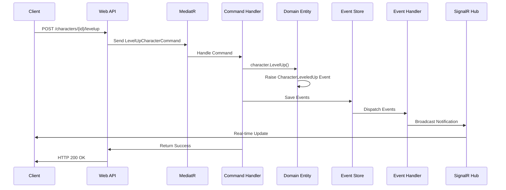

### Domain Events

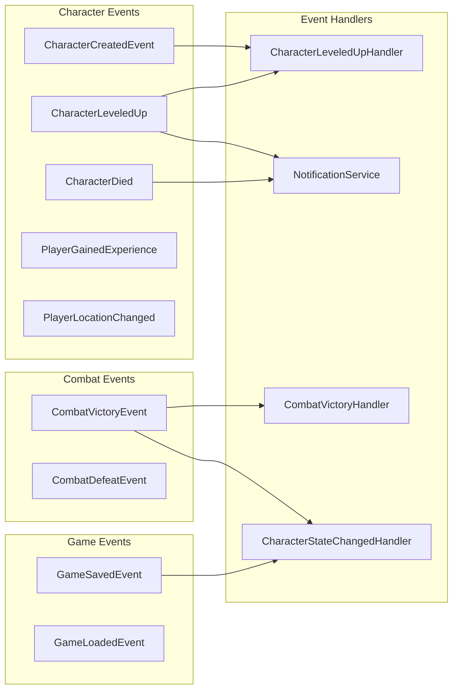

---

## 🏛️ CQRS Implementation

Commands and Queries are separated to optimize for different concerns:

### Command Flow

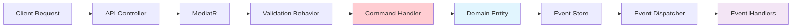

### Query Flow

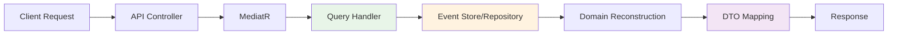

### Commands

- **CreateCharacterCommand**: Creates new player characters
- **LevelUpCharacterCommand**: Advances character level
- **EquipItemCommand**: Equips items to characters
- **UseItemCommand**: Consumes items from inventory

### Queries

- **GetCharacterByIdQuery**: Retrieves character details
- **GetAllCharactersQuery**: Lists all characters
- **GetCharacterInventoryQuery**: Retrieves character inventory
- **GetCharacterHistoryQuery**: Gets character event history

---

## 💾 Event Sourcing

Characters are persisted as streams of events rather than current state:

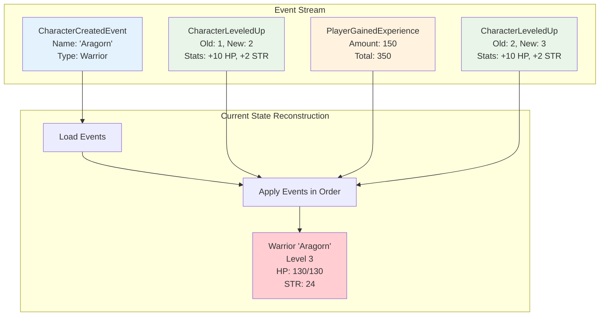

### Event Store Schema

```sql
CREATE TABLE StoredEvents (
    Id UNIQUEIDENTIFIER PRIMARY KEY,
    AggregateId UNIQUEIDENTIFIER NOT NULL,
    AggregateType NVARCHAR(255) NOT NULL,
    Version INT NOT NULL,
    EventType NVARCHAR(255) NOT NULL,
    EventData NVARCHAR(MAX) NOT NULL,
    Timestamp DATETIME2 NOT NULL,
    UserId NVARCHAR(255) NULL
);
```

### Benefits

- **Complete Audit Trail**: Every change is recorded
- **Temporal Queries**: Query state at any point in time
- **Bug Investigation**: Replay events to understand issues
- **Analytics**: Rich data for understanding player behavior

---

## 🎮 Game Systems

### Combat System

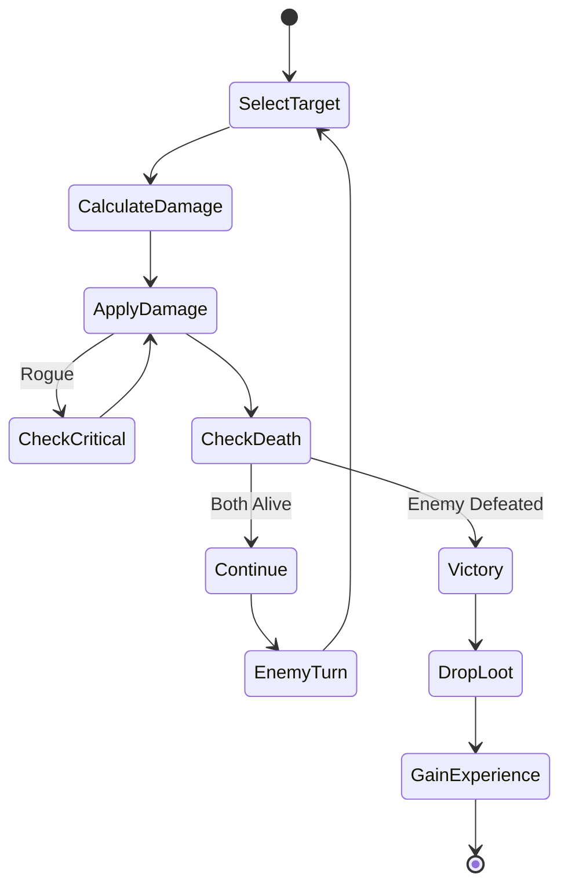

### Inventory System

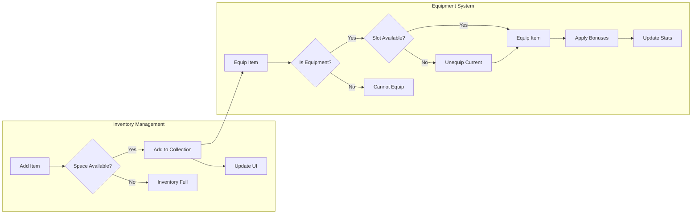

### Quest System (Planned)

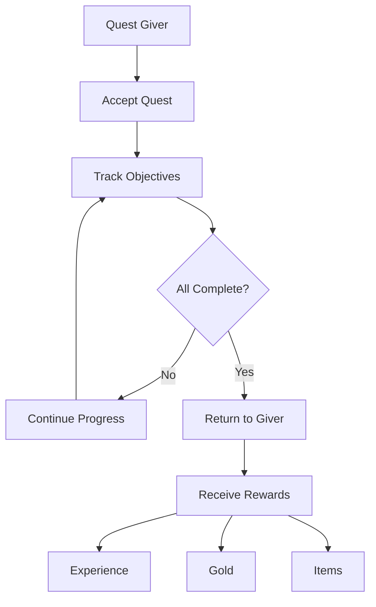

---

## 🔧 Technical Implementation

### Dependency Injection Setup

```csharp
// Program.cs - Web API
builder.Services.AddApplicationServices();
builder.Services.AddInfrastructureServices(builder.Configuration);

// Application Layer Registration
public static IServiceCollection AddApplicationServices(this IServiceCollection services)
{
    services.AddMediatR(cfg => cfg.RegisterServicesFromAssembly(Assembly.GetExecutingAssembly()));
    services.AddValidatorsFromAssembly(Assembly.GetExecutingAssembly());
    
    // Pipeline behaviors
    services.AddTransient(typeof(IPipelineBehavior<,>), typeof(ValidationBehavior<,>));
    services.AddTransient(typeof(IPipelineBehavior<,>), typeof(LoggingBehavior<,>));
    
    // Event infrastructure
    services.AddScoped<IEventDispatcher, EventDispatcher>();
    services.AddScoped<IEventSourcingService, EventSourcingService>();
    
    return services;
}
```

### Pipeline Behaviors

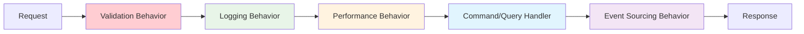

### API Versioning

```csharp
[ApiController]
[ApiVersion("1.0")]
[Route("api/v{version:apiVersion}/[controller]")]
public class CharactersController : ControllerBase
{
    // API endpoints
}
```

### Real-time Notifications

```csharp
// SignalR Hub for real-time updates
public class GameHub : Hub
{
    public async Task JoinCharacterGroup(Guid characterId)
    {
        await Groups.AddToGroupAsync(Context.ConnectionId, characterId.ToString());
    }
}

// Event handler that broadcasts notifications
public class NotificationService : IEventHandler<CharacterLeveledUp>
{
    public async Task HandleAsync(CharacterLeveledUp @event, CancellationToken cancellationToken)
    {
        await _hubContext.Clients.Group(@event.AggregateId.ToString())
            .SendAsync("GameEvent", new { Type = "level-up", Data = @event });
    }
}
```

---

## 🚀 Getting Started

### Prerequisites

- .NET 8 SDK
- Node.js 18+ (for Angular UI)
- SQLite (for local development)
- Visual Studio 2022 or VS Code

### Installation

1. **Clone the Repository**
    
    ```bash
    git clone https://github.com/yourusername/rpg-game.git
    cd rpg-game
    ```
    
2. **Build the Solution**
    
    ```bash
    dotnet build
    ```
    
3. **Run Console Application**
    
    ```bash
    cd src/RpgGame.Presentation
    dotnet run
    ```
    
4. **Run Web API**
    
    ```bash
    cd src/RpgGame.WebApi
    dotnet run
    ```
    
    API will be available at `https://localhost:7153`
    
5. **Run Angular UI**
    
    ```bash
    cd src/RpgGame.AngularUI/rpg-game-ui
    npm install
    ng serve
    ```
    
    UI will be available at `http://localhost:4200`
    

### Database Setup

The application uses SQLite with Entity Framework Core. The database is created automatically on first run.

---

## 📊 Project Structure

```
src/
├── RpgGame.Domain/                 # Core business logic
│   ├── Entities/                   # Domain entities
│   │   ├── Characters/            # Character hierarchies
│   │   ├── Items/                 # Item system
│   │   ├── Inventory/             # Inventory management
│   │   └── World/                 # Game world
│   ├── Interfaces/                # Domain interfaces
│   ├── Events/                    # Domain events
│   ├── Enums/                     # Domain enumerations
│   └── Base/                      # Base classes
│
├── RpgGame.Application/           # Application orchestration
│   ├── Commands/                  # Write operations
│   ├── Queries/                   # Read operations
│   ├── Events/                    # Event handling
│   ├── Services/                  # Application services
│   ├── Behaviors/                 # Pipeline behaviors
│   └── Interfaces/                # Application interfaces
│
├── RpgGame.Infrastructure/        # External concerns
│   ├── Persistence/              # Data access
│   │   ├── EFCore/               # Entity Framework
│   │   ├── Repositories/         # Repository implementations
│   │   └── EventStore/           # Event storage
│   └── Services/                 # External services
│
├── RpgGame.Presentation/         # Console UI
│   ├── Views/                    # Console views
│   ├── Commands/                 # Console commands
│   └── ConsoleUI/                # Console infrastructure
│
├── RpgGame.WebApi/               # REST API
│   ├── Controllers/              # API controllers
│   ├── DTOs/                     # Data transfer objects
│   ├── Filters/                  # API filters
│   ├── Hubs/                     # SignalR hubs
│   └── Services/                 # API services
│
└── RpgGame.AngularUI/            # Angular frontend
    └── rpg-game-ui/
        ├── src/app/
        │   ├── components/       # Angular components
        │   ├── services/         # Angular services
        │   └── models/           # TypeScript models
        └── ...
```

---

## 🧪 Testing Strategy

### Unit Tests

```csharp
[TestClass]
public class CharacterTests
{
    [TestMethod]
    public void Character_LevelUp_ShouldIncreaseStats()
    {
        // Arrange
        var warrior = Warrior.Create("TestWarrior");
        var initialLevel = warrior.Level;
        var initialHealth = warrior.MaxHealth;

        // Act
        warrior.LevelUp();

        // Assert
        Assert.AreEqual(initialLevel + 1, warrior.Level);
        Assert.AreEqual(initialHealth + 10, warrior.MaxHealth);
    }
}
```

### Integration Tests

```csharp
[TestClass]
public class CharacterControllerTests : IntegrationTestBase
{
    [TestMethod]
    public async Task CreateCharacter_ShouldReturnCreatedCharacter()
    {
        // Arrange
        var request = new CreateCharacterDto 
        { 
            Name = "TestHero", 
            Type = CharacterType.Warrior 
        };

        // Act
        var response = await Client.PostAsJsonAsync("/api/v1/characters", request);

        // Assert
        response.EnsureSuccessStatusCode();
        var character = await response.Content.ReadFromJsonAsync<CharacterDto>();
        Assert.AreEqual("TestHero", character.Name);
    }
}
```

---

## 📈 Future Enhancements

### Planned Features

- **Multiplayer Support**: Real-time multiplayer battles
- **Advanced Quest System**: Branching storylines and complex objectives
- **Crafting System**: Item creation and enhancement
- **Guild System**: Player organizations and group activities
- **PvP Arena**: Player vs Player combat
- **Achievement System**: Unlockable rewards and progression tracking

### Technical Improvements

- **Microservices**: Split into bounded contexts
- **CQRS Read Models**: Optimized query projections
- **Distributed Event Store**: Scale event storage
- **Caching Layer**: Redis for performance optimization
- **GraphQL API**: Flexible query capabilities
- **Mobile Apps**: Native iOS/Android clients

---

## 🤝 Contributing

We welcome contributions! Please follow these guidelines:

1. **Fork the Repository**
2. **Create a Feature Branch**
    
    ```bash
    git checkout -b feature/amazing-feature
    ```
    
3. **Commit Changes**
    
    ```bash
    git commit -m 'Add amazing feature'
    ```
    
4. **Push to Branch**
    
    ```bash
    git push origin feature/amazing-feature
    ```
    
5. **Open a Pull Request**

### Development Guidelines

- Follow SOLID principles
- Write comprehensive tests
- Use meaningful commit messages
- Document public APIs
- Maintain backwards compatibility

---

## 📝 License

This project is licensed under the MIT License - see the [LICENSE](https://claude.ai/chat/LICENSE) file for details.

---

## 🏆 Acknowledgments

- **Eric Evans** - Domain-Driven Design concepts
- **Robert C. Martin** - Clean Architecture principles
- **Martin Fowler** - Enterprise patterns and event sourcing
- **Microsoft** - .NET ecosystem and documentation
- **Angular Team** - Frontend framework
- **MediatR Contributors** - CQRS implementation